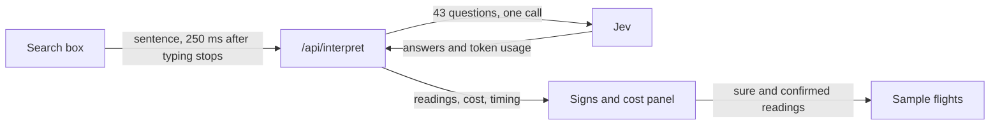

# flight-search

Type a trip in plain words, such as "cheap nonstop from Boston to Lisbon early next month", and watch it turn into a flight search as you type.
The real subject is Jev: every reading shows what it cost, how many tokens it used, and how fast it came back.
The flights are generated sample data, not real fares.

Run it from the repo root with `npm run dev:flight-search`, then open http://localhost:3000.

## How it uses Jev

Each time you pause typing for 250 ms, the page sends your sentence to Jev in a single call with 43 questions.
Jev answers all of them in parallel, and the code ignores the ones that do not apply.
TypeSafe calls this speculative fan-out.

| Question type | Used for |
| --- | --- |
| Choice | Origin and destination (each over 79 airports), time of day, cabin, and the parts of a date |
| Noul | Whether a place is named, nonstop, no red-eyes, whether any airline is named, and one question per airline to avoid (24) |
| Score | How much the traveler cares about price compared with a fast, convenient trip |

Every answer comes with a probability or a confidence, and the page acts on it in three bands.

- **Sure** (Noul at 0.8 or more, Choice confidence at 0.6 or more) applies right away as a solid yellow sign.
- **Guess** (Noul at 0.5 or more, Choice confidence at 0.3 or more) shows as a dashed sign with a question mark, and applies only when you click it.
- **Below that**, the answer is ignored.

If you describe a kind of place, like "somewhere warm in Europe", the page lists the airports where Jev put the most probability.

The per-airline answers only count when the "is any airline named" question says yes.
Without that gate, Jev leans toward yes for airlines that do not fit the route.
Yes-or-no questions also spell out what counts as no, so a preference you never mentioned stays off.

Jev is weak at arithmetic and does not generate text, so code does that work.
For dates, Jev only reads the parts ("October", "12", "next", "Friday", "early in the month") and `src/lib/dates.ts` turns them into real dates.
A named weekday wins over the "today" or "tomorrow" question, because Jev reads weekdays far more reliably.
This follows TypeSafe's own date extraction recipe.

## How a reading flows

The key never reaches the browser.
`next.config.ts` loads it from the root `.env.local`, and only `src/lib/typesafe.ts` reads it.
That file imports `server-only`, so the build fails if client code ever imports it.

## Code map

| File | Job |
| --- | --- |
| `src/lib/questions.ts` | Every question sent to Jev |
| `src/lib/interpret.ts` | Makes the Jev call and measures time, tokens and cost |
| `src/lib/read-intent.ts` | Turns answers into sure or guessed readings |
| `src/lib/dates.ts` | Calendar math for the date parts Jev reads |
| `src/lib/search-state.ts` | Combines readings with your clicks into the search that runs |
| `src/lib/flights.ts` | Generates and filters the sample flights |
| `src/lib/pricing.ts` | Jev list prices, used to estimate cost |
| `src/app/api/interpret/route.ts` | The only route that calls Jev |
| `src/components/usage-board.tsx` | The cost, tokens and speed sidebar and top bar |

## Cost, tokens and speed

The sidebar leads with the running total for the visit: spent, tokens and readings.
The last reading's cost, tokens and response time sit below it.
On narrow screens the same numbers sit in a bar at the top.
Each reading costs about the same, because the 43 questions make up almost all of the input tokens and the sentence adds only a few.
Costs are estimates from the list price in `src/lib/pricing.ts`, and only input tokens are billed.
Update that file when TypeSafe ships a new model version.

## Scripts

Run these in this folder, or from the root to check every experiment.

- `npm run dev` starts the dev server.
- `npm run build` creates a production build.
- `npm run lint` runs ESLint.
- `npm run typecheck` generates the Next.js route types, then runs the TypeScript compiler.
- `npm test` runs the unit tests.
